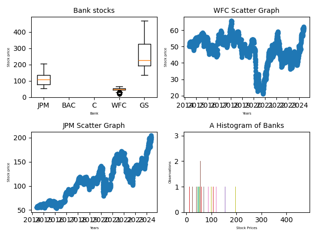

#Data-visualization-of-stocks

#Required website:
https://iexcloud.io/
https://crontab.guru/

#Unix commands:
Command to connect to EC2 serever from the Command Prompt:
ssh -i project123.pem ec2-user@ipaddress

Import python libraries in EC2 instance:
sudo yum install python3-pip
pip3 install pandas
pip3 install boto3

Command to copy the file from local folder to the EC2 instance
scp -i path/to/.pem_file path/to/file   username@host_address.amazonaws.com:/path_to_copy

Creating cron jobs
vim bank_stock_data.cron
00 7 * * 7 python3 gather_data.py #add to bank_stock_data.cron by choosing the interval from cron guru website
crontab -l  # listing cron jobs
crontab bank_stock_data.cron  #adding cron jobs

Step 1 : 
gather_data.py will collect the data from IEX Cloud. Plot the graphs and upload the data to S3 bucket.
Create S3 bucket and give it's name in gather_data.py
Give all the permissions to S3 bucket and modify the bubcket_policy.json 

The graph generated will be as following :

Step 2 :

Step 3 :

Step 4 :

The gather_data.py script gather the data of banks. The processing is done using the Pandas and Matplotlib. The data is then loaded to amazon S3 bucked.

